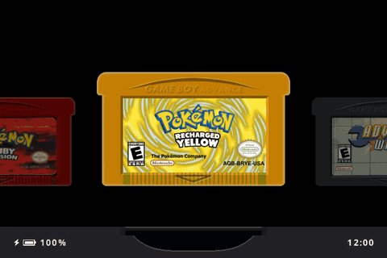

---

# What is slot?

A bespoke, Game Boy-centric frontend for the Anbernic RG SP.

Has support for GBA, GBC, and GB titles only.

> [!IMPORTANT]
> ROMs must be unzipped. slot does not read `.zip` or `.7z` files.

A full user guide can be found at [slot-cfw.fyi](https://slot-cfw.fyi).

Release notes can be found in the [changelog](CHANGELOG.md).

---

# What does it look like?

---

# Supported Devices

| Device | Supported | Since Version |
| --- | --- | --- |
| Anbernic RG SP | Yes | Always |
| Anbernic RG34XX | Untested | N/A |
| Anbernic RG34XXSP | Untested | N/A |
| Anbernic RG35XXSP | Yes | 1.5.0 |

The RG34XX will likely work from 1.4.0. The RG34XXSP may not map its sticks correctly.

If you have one of the Untested devices, or have tried slot on a device not listed, please [open an issue on GitHub](https://github.com/BrandonKowalski/slot/issues) and let me know how it went.

---

# AI Disclosure

The Rust frontend was put together by Claude Opus. I reviewed everything that was
produced. All documentation is 100% free-range, meatbag prose.

The project is extremely low stakes. I wanted a bespoke frontend for my RG SP and thought
that something that evokes the feeling of using my GBA SP as a kid would be pretty neat.

Use it, don't use it, I don't care.

Figured I should share the end result of all the wasted water. ✌🏻

---

## KONKR Pocket Advance Android port (experimental)

The Android fork is maintained on `feat/konkr-save-parity` and currently
targets GB/GBC/GBA games on KONKR Pocket Advance. The Linux upstream remains
the visual/interaction reference. Android uses the Storage Access Framework
to select ROM/BIOS and optional shared RetroArch saves/state directories.

### Library and save behaviour

- The first ROM scan is stored in an app-private atomic cache. Reopening the
  app restores the cartridge shelf immediately; use **Library → Refresh Library**
  after adding, deleting or moving ROMs.
- Manual Polaroids remain in the original Slot state history. Saving also
  exports the first unused RetroArch numbered `.state` slot if a states
  folder was selected. An auto-state is stored separately.
- The original SVG silhouettes and molded details are preserved. The KONKR
  Android rendering uses a subtle deterministic satin finish, applied before
  drawing the original cartridge labels.
- Android uses the original Slot insert/eject PCM and screen-power timings.
  Feedback, buttons and icon resources are taken from the upstream UI.
- **Experimental**: external slot import, gpSP parity and long-term save
  compatibility should be verified on real handheld hardware.

### Reproducible Android signing (required for in-place updates)

GitHub Actions uses a different temporary debug key on each hosted runner,
so such unsigned-configuration debug builds cannot be upgraded in place.
One-time setup by a repository administrator on a trusted Mac/Linux machine:

1. Install Java `keytool` and GitHub CLI `gh`, then `gh auth login`.
2. Run `bash scripts/configure-konkr-signing.sh` from this branch.
3. This creates a permanent PKCS#12 key under
   `~/.config/slot-konkr-signing/` and saves its encrypted contents and
   credentials as GitHub Actions secrets.
4. Keep a secure backup of the local signing directory. Never commit,
   publish or send its contents.
5. Run the Android workflow again after configuration. All subsequent APKs
   must use this *same* key (and a higher `versionCode`) to support
   `adb install -r`.

The first permanently signed build will still require a clean reinstall
from a previously *differently signed* debug APK. Back up private app data
first if it matters.

